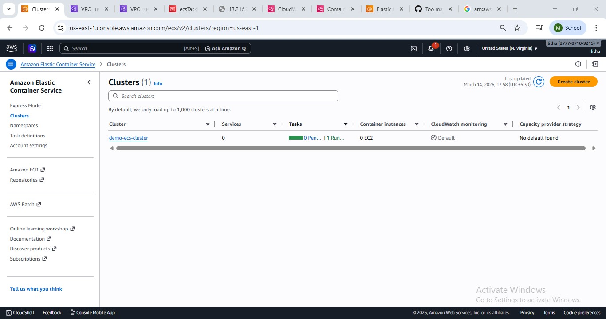
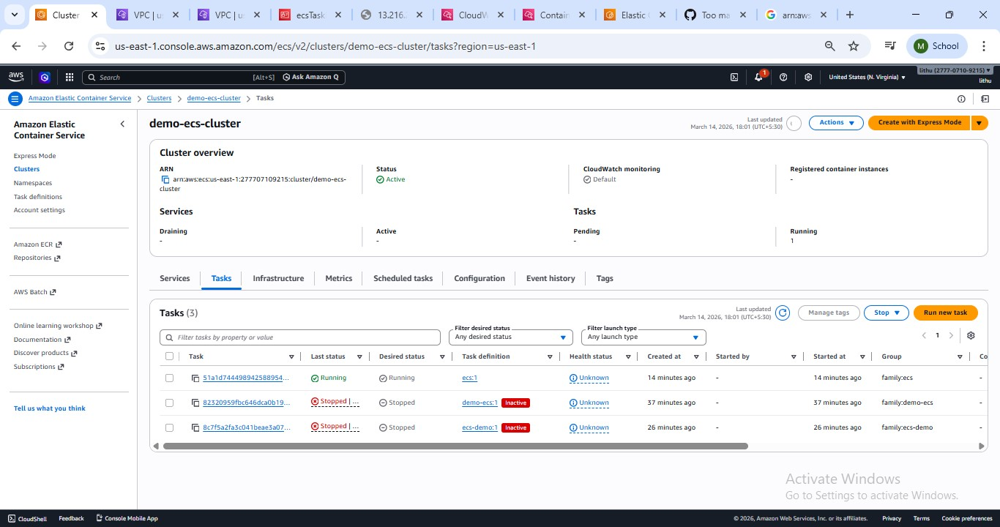
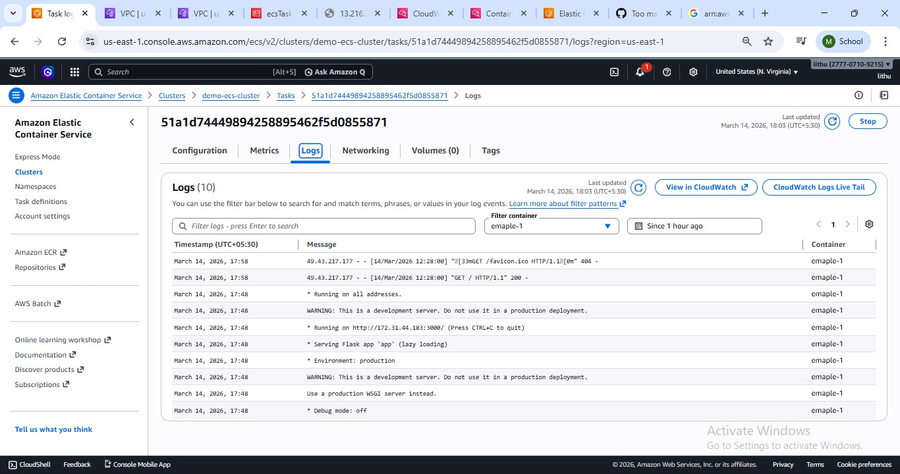
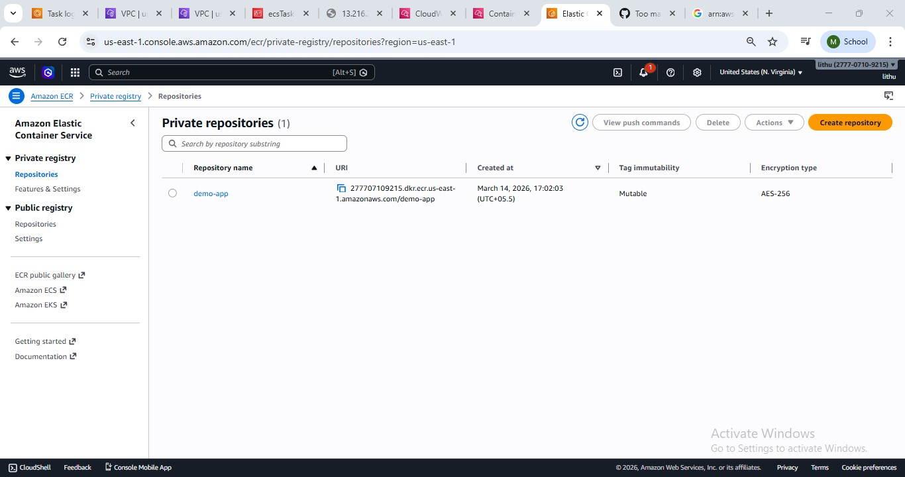
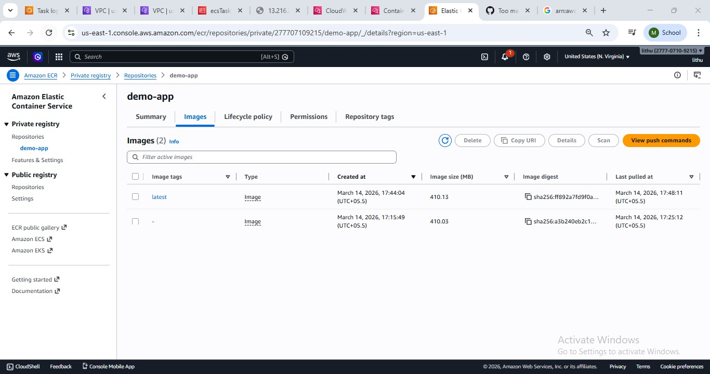

# ECS Flask Deployment using Docker

## Project Overview

This project demonstrates how to deploy a Python Flask application on AWS ECS using Docker.

Steps performed:

* Containerized a Python Flask application using Docker
* Built the Docker image
* Pushed the image to a container registry
* Created an ECS cluster
* Deployed the container as an ECS task
* Configured networking and security groups
* Accessed the application via public IP

---

## ECS Task Running

---

## ECS Task Logs

---

## Container Logs / Error Debugging

---

## Security Group Configuration

---

## Networking Configuration

---

## Application Running in Browser

---

## Technologies Used

* Docker
* AWS ECS
* AWS Fargate
* CloudWatch Logs
* Python Flask
* GitHub

---

## Outcome

Successfully deployed a containerized Flask application on AWS ECS and accessed it through a public IP address.

